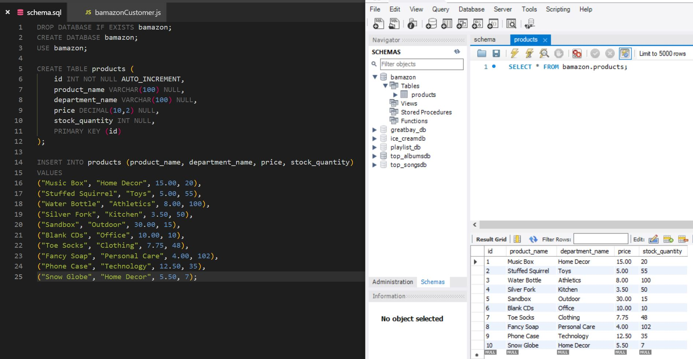
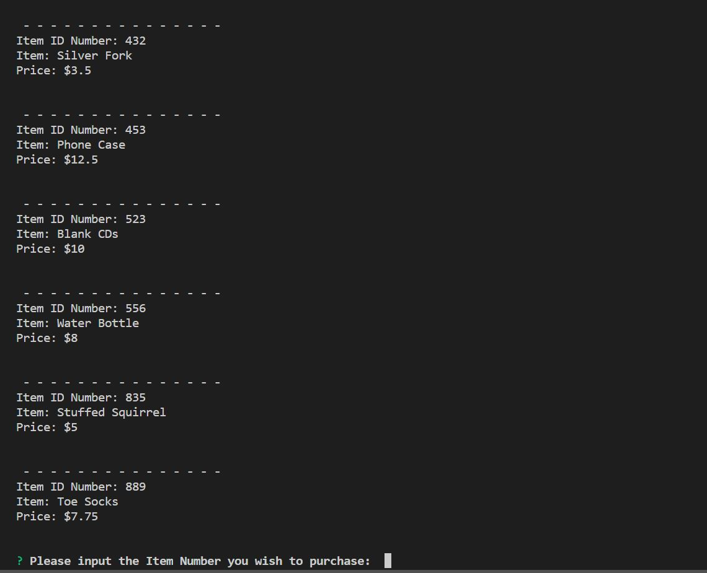
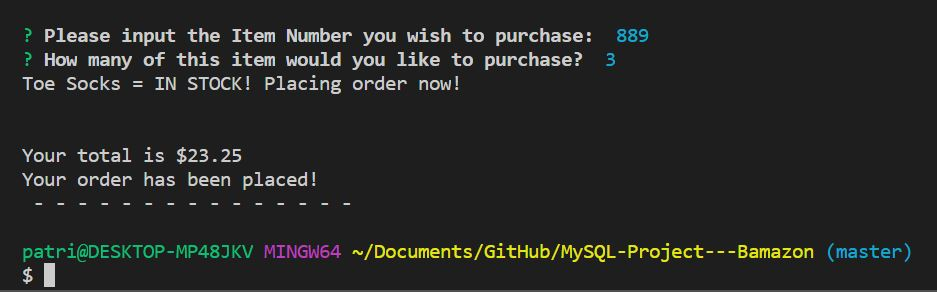
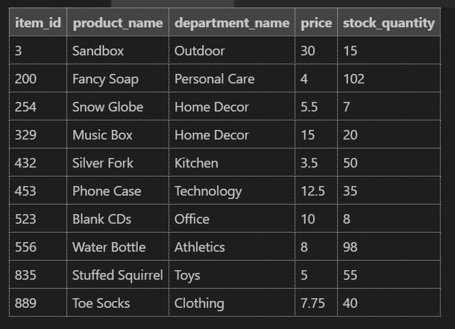

# MySQL Project - Bamazon

## Walkthrough of Application, with Screenshots

### Challenge #1: Customer View

1. Created a MySQL Database called `bamazon`.

2. Then created a Table inside of that database called `products`.

3. The products table has each of the following columns:

   * item_id (unique id for each product)

   * product_name (Name of product)

   * department_name

   * price (cost to customer)

   * stock_quantity (how much of the product is available in stores)

4. Populated this database with around 10 different products.

    

5. Then created a Node application called `bamazonCustomer.js`. Running this application will first display all of the items available for sale. Include the ids, names, and prices of products for sale.

    

6. The app then prompts users with two messages.

   * The first asks them the ID of the product they would like to buy.
   * The second message asks how many units of the product they would like to buy.

    

7. Once the customer has placed the order, the application checks if the store has enough of the product to meet the customer's request.

   * If not, the app would log a phrase like `Insufficient quantity!`, and then prevent the order from going through.

8. However, if the store _does_ have enough of the product, we fulfill the customer's order.
   * This means updating the SQL database to reflect the remaining quantity, as seen below.
   * Once the update goes through, the application shows customer the total cost of their purchase, as seen above.

    